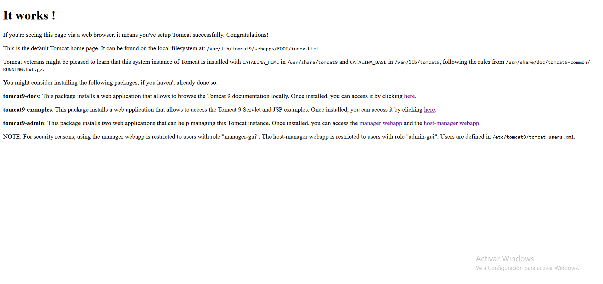

# Practica Tomcat con Maven

## Primero deberemos ejecutar los siguientes comandos

`sudo apt -y update`
`sudo apt install -y openjdk-11-jdk`
`sudo apt install -y tomcat9`

De esta manera lo que haremos es instalar el jdk(java developer kit) y tomcat9 utilizado para el despliegue de aplicaciones web principalmente.

`sudo groupadd tomcat9 \                                                                                                       sudo useradd -s /bin/false -g tomcat9 -d /etc/tomcat9 tomcat9`

Añadimos un grupo llamado tomcat9 y dentro de este creamos un usuario llamado igualmente tomcat9.

`sudo systemctl start tomcat9`
`sudo systemctl status tomcat9`

Encendemos el servidor y comprobamos su estado

### Log del estado del servidor

### Lo que muestra localhost:8080

### Vista del manager webapp

### Vista del host-manager webapp

## Maven

Ahora procederemos a instalar maven para ello ejecutamos lo siguiente: 

`sudo apt-get update && sudo apt-get -y install maven`

Tras ello y tocar el settings.xml(Mi maquina lo hace de manera automatica), ejecutamos el siguiente comando: 

`mvn archetype:generate -DgroupId=org.zaidinvergeles \ -DartifactId=tomcat-war-deployment \ -DarchetypeArtifactId=maven-archetype-webapp \ -DinteractiveMode=fa`

Esto nos generara un proyecto llamado tomcat-war-deployment. Accedemos a su pom.xml y lo modificamos como viene en el propio pom.xml de mi repositorio. Tras ellos desplegamos la aplicacion con el comando: 

`sudo mvn tomcat7:deploy`

### vista de la ruta http://localhost:8080/despliegue/

